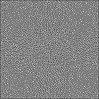
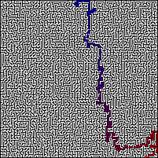

# Labirinto

Projeto para a disciplina Paradigmas de Programação, da Universidade Federal do ABC, orientado pelo professor [Emilio Francesquini](https://github.com/francesquini).

## Proposta

O trabalho proposto é baseado nesse [vídeo](https://github.com/mikepound/mazesolving) do canal Computerphile. A ideia é criar um programa que resolve labirintos a partir de imagens.

Dada uma imagem, onde pixels brancos representam caminho e pixels pretos representam parede, a borda é feita de parede, exceto por dois pixels (uma entrada e uma saída). O programa deve encontrar o caminho entre a entrada e a saída e o output do programa deve ser uma imagem com o mesmo labirinto, mas com o caminho que deve ser feito do ínicio à saida destacado.

Abaixo, um exemplo de uma entrada e de uma saída do programa.

Além disso, o programa mostra o tempo de execução de cada algoritmo

## Execução

-   `stack run [mazeName]` roda o programa para os 3 algoritmos (BFS, DFS e A\*) no labirinto passado como parâmetro. Para isso, a imagem de nome `mazeName.png` deve existir na pasta `labirinto/resources/mazes`. As imagem de saída deverão se encontrar na pasta `labirinto/output/mazes` (é importante garantir que a pasta existe antes da execução do programa).

-   `stack test` roda os testes (unitários e de integração) do programa. Os testes são especificados em `labirinto/test/Spec.hs`.

-   #### Observação: Os labirintos MAZE00 - MAZE05 são usados nos testes. Assim, é importante que eles estejam presentes na pasta `labirinto/resources/mazes` ao rodar o comando `stack test`

TODO: stack run generateMaze

Assim, a estrutura do projeto deve se econtrar na forma:

    labirinto
     |_ output
       |_ mazes
     |_ resources
       |_ mazes
     |_ app
     |_ src
     |_ test

## Dificuldades no desenvolvimento

A maior dificuldade enfrentada foi a integração de todos os módulos. Módulos desenvolvidos independentemente tiveram alguma dificuldade para serem integrados, o que resultou falhas nos testes de integração desenvolvidos.

Além disso, houve também um erro de planejamento que, somado à semana de provas e de entragas de outos trabalhos, resultou na necessidade de grandes esforços no fim de semana da entrega.

Os testes foram escritos com o Hspec, sendo que algum deles usam o QuickCheck. Descobrir como criar testes e propriedades com essa biblioteca foi bem trabalhoso. Em específico, implementar a classe Arbitrary para os nos, arestas e grafos (Node, Edge e Graph) foi especialmente desafiador (essa implementação se encontra no arquivo `labirinto/test/Spec.hs`). Contudo, no final, deu certo, e foi possível realizar testes com Grafos Arbitrários.

## Créditos

Autores: [Bryan Cruz](https://github.com/BryanCruz/), [Daniel Escudero](https://github.com/DanEscudero), [Filipi Brabo](https://github.com/FilipiBrabo), [Jonatas Duarte](https://github.com/jonatas57).
